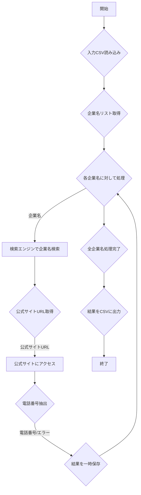

# 基本設計書

## 1. システム構成

本システムは、以下の主要なコンポーネントで構成される。

*   **`main.py`**: プログラムのエントリポイント。全体の処理フローを制御し、各モジュールを連携させる。
*   **`data_handler.py`**: 入力CSVファイルの読み込み、出力CSVファイルの書き込み、およびデータ変換を担当する。
*   **`scraper.py`**: Playwright MCPを使用してウェブスクレイピングを実行する。企業名の検索、公式サイトへのアクセス、電話番号の抽出を行う。

## 2. データフロー

1.  `data_handler.py` が `input` ディレクトリ内のCSVファイルから企業名リストを読み込む。
    *   CSVファイルは `company_name` カラムを持つ。
2.  `main.py` が企業名リストを `scraper.py` に渡し、各企業名に対してスクレイピング処理を指示する。
3.  `scraper.py` は以下の手順で情報を取得する。
    *   Playwrightを使用して検索エンジン（例: Google）で企業名を検索する。
    *   検索結果から企業の公式サイトのURLを特定する。
    *   公式サイトにアクセスし、ページコンテンツから電話番号を抽出する。
    *   取得した電話番号、または取得できなかった場合はその旨を `main.py` に返す。
4.  `main.py` は `scraper.py` から受け取った結果を収集し、`data_handler.py` に渡す。
5.  `data_handler.py` は収集された結果を `output` ディレクトリにCSVファイルとして書き出す。
    *   出力CSVファイルは `企業名`、`企業HPのURL`、`電話番号` のカラムを持つ。

## 3. エラーハンドリング

*   ウェブサイトへのアクセス失敗、要素の特定失敗、電話番号の抽出失敗など、スクレイピング中に発生する可能性のあるエラーは適切に捕捉する。
*   エラーが発生した場合でも、処理は停止せず、該当企業の情報をスキップし、ログにエラー内容を記録して次の企業名の処理に進む。
*   最終的な出力CSVには、エラーが発生した企業についても「電話番号が見つかりませんでした」などの情報を含める。

## 4. Playwright MCPの利用

*   Playwright MCPを使用して、ブラウザの起動、ページ遷移、要素の検索、テキスト抽出などの操作を自動化する。
*   ヘッドレスモードでの実行を基本とするが、デバッグ時にはヘッドフルモードに切り替えられるようにする。
*   CAPTCHAやボット対策への対応は、必要に応じて検討する。

## 5. 入出力の詳細

### 5.1. 入力

*   **場所**: `input/` ディレクトリ
*   **形式**: CSVファイル
*   **カラム**: `company_name` (日本語の企業名)

### 5.2. 出力

*   **場所**: `output/` ディレクトリ
*   **形式**: CSVファイル
*   **カラム**: `企業名`, `企業HPのURL`, `電話番号`
    *   `企業HPのURL` は、検索結果から特定した公式サイトのURL。
    *   `電話番号` は、公式サイトから抽出した電話番号。見つからない場合は空欄または特定の文字列（例: "N/A"）とする。

## 6. 今後の検討事項

*   検索エンジンの選択と、検索クエリの最適化。
*   公式サイト内での電話番号の多様な表現（画像、JavaScriptで生成など）への対応。
*   複数の電話番号が見つかった場合の優先順位付け。
*   プロキシの利用方法。
*   並行処理によるスクレイピング速度の向上。
